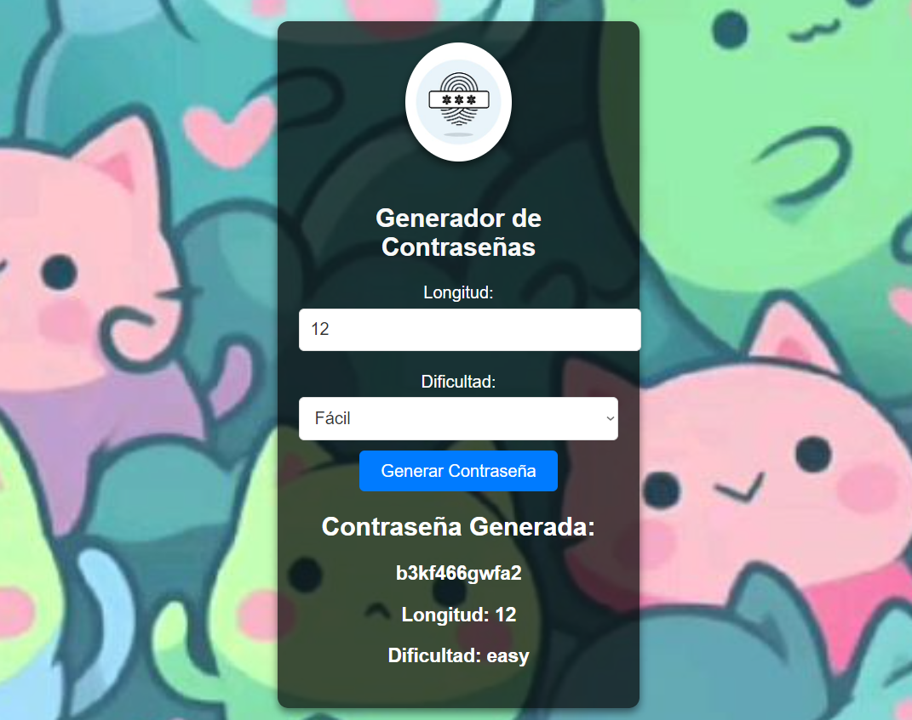

## `Manual de Usuario`

---

# Manual de Usuario del Generador de Contraseñas

Bienvenido al manual de usuario del generador de contraseñas. Aquí encontrarás instrucciones sobre cómo utilizar la aplicación web para generar contraseñas seguras.

## Acceso a la Aplicación

1. **Inicia el Servidor**

   Asegúrate de que el servidor Go esté en funcionamiento ejecutando el comando `go run main.go` desde el directorio del proyecto.

2. **Abre tu Navegador**

   Navega a [http://localhost:8080](http://localhost:8080) para acceder a la interfaz web del generador de contraseñas.

## Uso de la Interfaz Web

### 1. Introducción

Al abrir la aplicación, verás la interfaz principal con el logo del generador de contraseñas en la parte superior y un formulario para generar contraseñas.

### 2. Configuración de Contraseña

- **Longitud:** 
  - Introduce la longitud deseada para la contraseña en el campo de entrada "Longitud". La longitud mínima es de 6 caracteres.
  
- **Dificultad:**
  - Selecciona el nivel de dificultad para la contraseña usando el menú desplegable "Dificultad". Las opciones disponibles son:
    - **Fácil**: Incluye letras minúsculas y números.
    - **Avanzado**: Incluye letras minúsculas, mayúsculas y números.
    - **Muy Avanzado**: Incluye letras minúsculas, mayúsculas, números y caracteres especiales.
    - **Extremo**: Incluye letras minúsculas, mayúsculas, números, caracteres especiales y caracteres adicionales.

### 3. Generar Contraseña

- **Botón "Generar Contraseña":** 
  - Haz clic en este botón para generar una contraseña basada en los parámetros que has especificado. La contraseña generada se mostrará debajo del formulario.

### 4. Resultados

- **Contraseña Generada:**
  - Después de hacer clic en el botón "Generar Contraseña", la contraseña generada se mostrará en la sección "Contraseña Generada".
  - También se mostrará la longitud y la dificultad de la contraseña generada.

## Problemas Comunes

- **Contraseña No Generada:** 
  - Asegúrate de haber introducido un valor válido para la longitud y haber seleccionado una dificultad. La longitud mínima es 6 caracteres.

- **Estilo No Aplicado:**
  - Si el diseño no se aplica correctamente, asegúrate de que el archivo CSS (`styles.css`) está en la carpeta `static` y que el servidor Go está funcionando correctamente.

